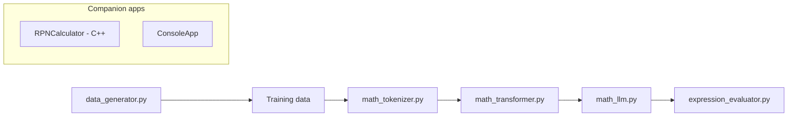

# PyLLM Architecture

## Training and inference

```mermaid
flowchart LR
    DG[data_generator.py] --> TR[Training data]
    TR --> TOK[math_tokenizer.py]
    TOK --> XF[math_transformer.py]
    XF --> LLM[math_llm.py]
    LLM --> EV[expression_evaluator.py]
    subgraph "Companion apps"
        RPN[RPNCalculator - C++]
        CA[ConsoleApp]
    end
```
